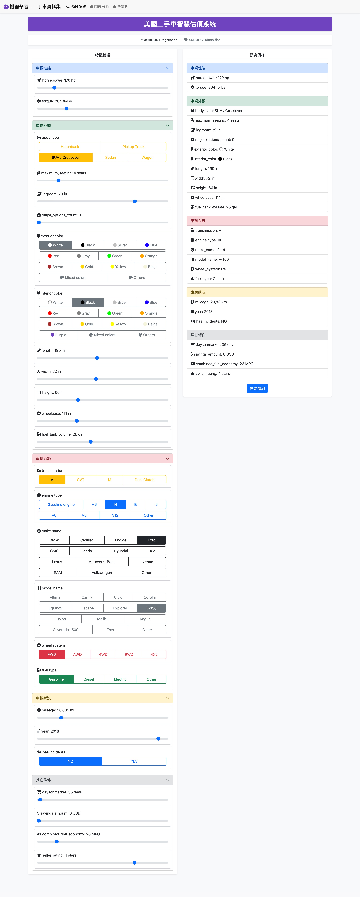
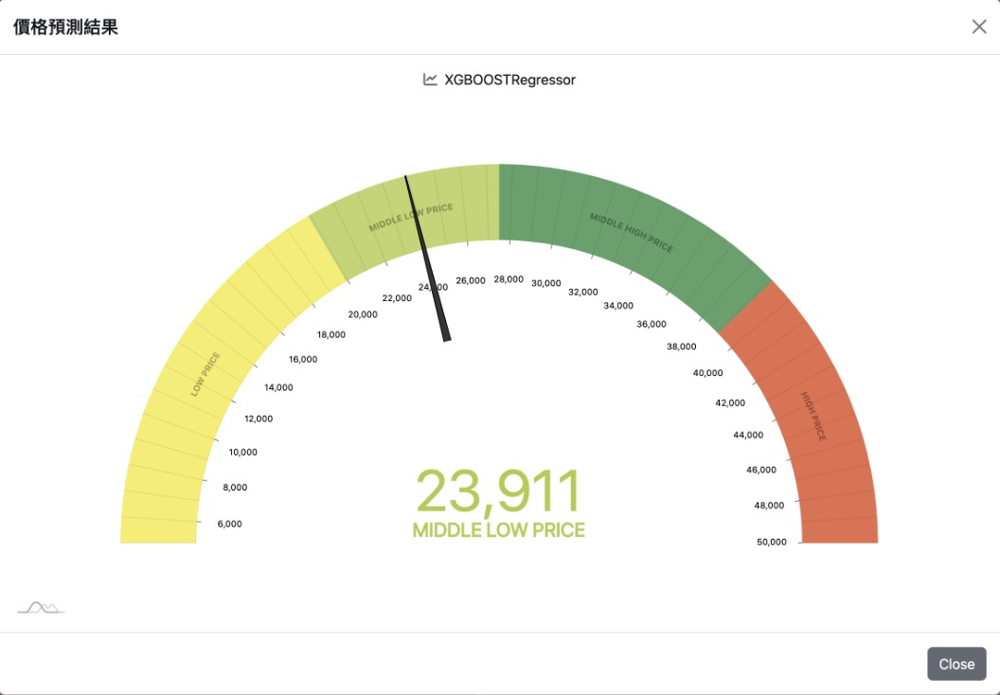
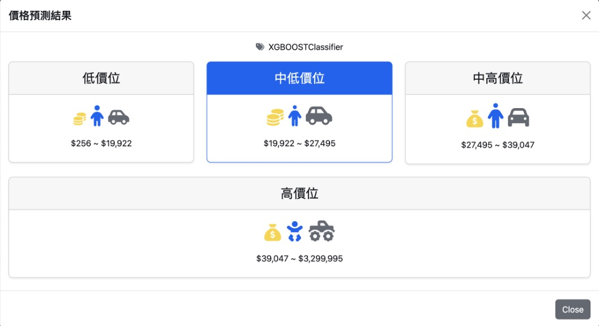
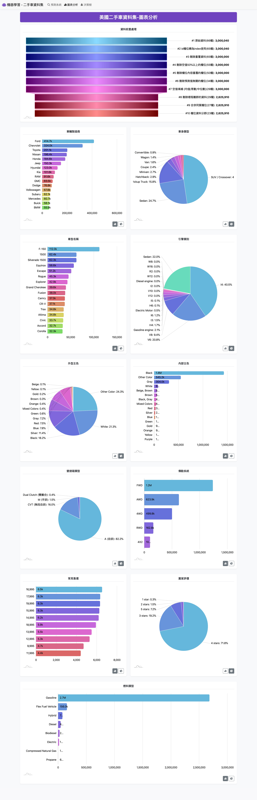
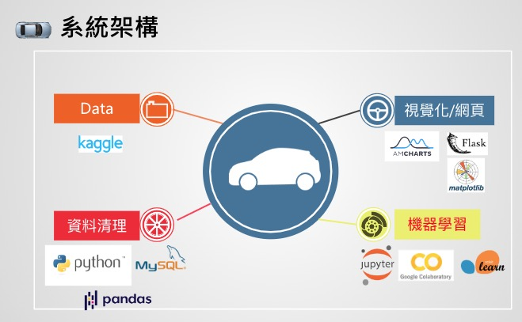

# used-cars-price-prediction

此專案的情境設定是透過機器學習的方法，為特定特徵的二手車輛預測在市場上的售價為何，以便提供二手車經銷商在做定價時的參考；最後將整個系統部署到網站上使用。 [DEMO Site](https://yunhung2000.pythonanywhere.com)

訓練模型的資料集使用美國二手車網站Cargurus在2020年9月的資料，原始資料集筆數3,000,040筆、66欄位、檔案大小9.98GB。 ref: [Kaggle](https://www.kaggle.com/datasets/ananaymital/us-used-cars-dataset)







Running the server
```
export FLASK_APP=flask_app.py
flask run
```

Running the server with debug mode
```
export FLASK_APP=flask_app.py
export FLASK_DEBUG=1
flask run
``` 